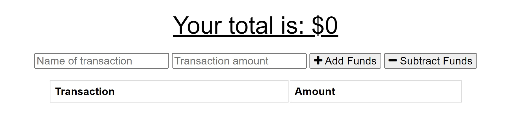
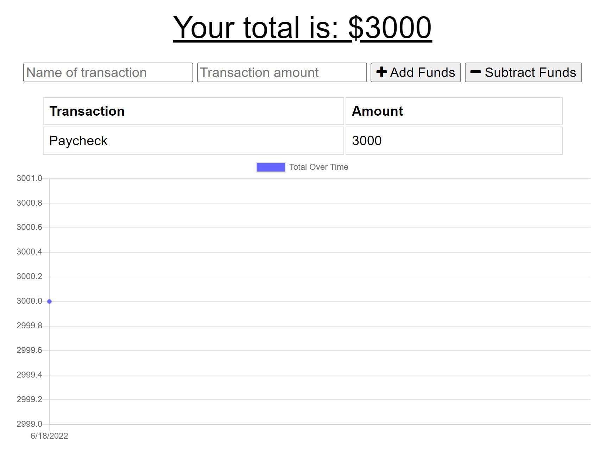
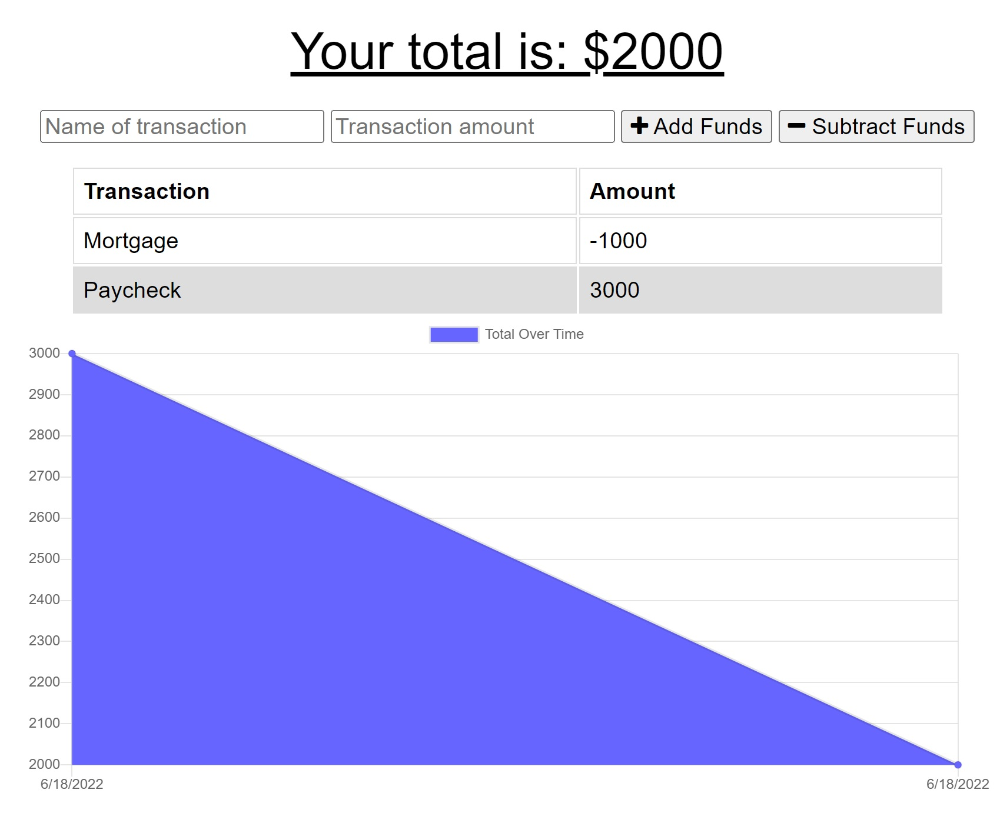
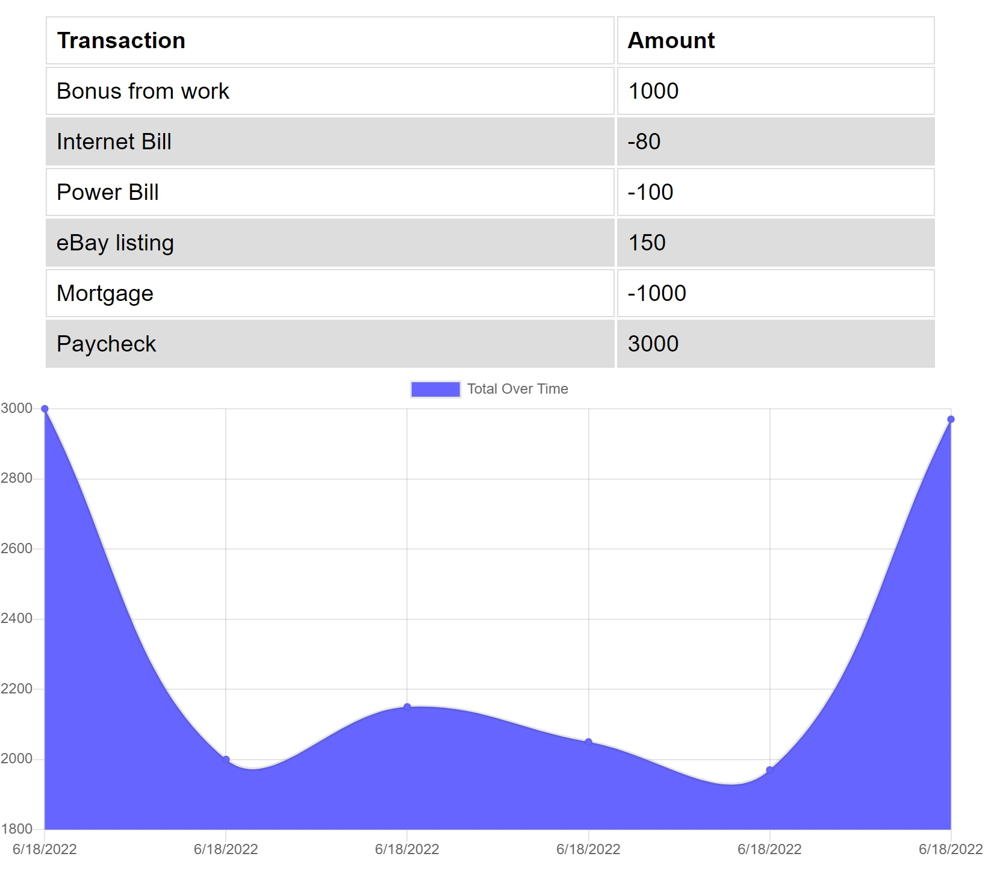

# Dollar Caller 

  # About
  Dollar Caller is an app that allows you to keep track of your income as well as expenses, to make keeping your budget easy, with line items showing changes, as well as a graph to help you analyze your spending habits. Tracking your money is easy and will help whether you are trying to save, or just figure out how much you can afford to spend.
  
  ## Table of Contents
  - [Intallation](#installation)
  - [Usage](#usage)
  - [Credit](#credit)
  - [License](#license)
  - [Contribute](#contribute)
  - [Tests](#test)
  - [Questions](#test)

  # Installation
  Install the repo, and make sure you have mongoDB to access the database where your spending will be stored to reference later. Once the contents of the repo are installed, point your terminal to the root folder and enter 'npm i' to install all of the required dependencies from npm. 

  # Usage
  When Dollar Caller is first opened, you will see an empty graph with some controls above it. You'll use these controls to input your budgetary information, and the graph will update automatically based upon the data that you input.

  

  To begin, enter a starting number. This can either be the amount you have at the present time, or your most recent income. For the purpose of this example, we'll say it's the first paycheck you've received that you'd like to include towards your budget. In the first text field, enter the source of the funds, then in the second field, enter the dollar amount. When this information is entered, press the 'Add funds' button and this amount will be added into your total budget. 

  

  The graph cannot be properly displayed until we have at least two points of data. So next, enter another transaction. For example, if you are paying a bill, fill out the text fields with the name of the expense, as well as the dollar amount, and this time use the "Subtract Funds" button. This will remove the number from your total budget, and the graph will display since we now have a flow with our data that can be measured. 

  

  Over time, as you add additional data, it will be easier to analyze your spending and better understand the flow of your finances. This will help you to keep tabs on where money is going, and how fast it is accumulating. 

  

  # Credit
  Created by Austin Carter. 

  # License
  This project is covered under the gpl3.0 license. For more information, visit this [resource](https://choosealicense.com/licenses/) on project licenses.

  # Questions
  If you have any questions, you can find me on [github](https://github.com/auscarter17).
  

